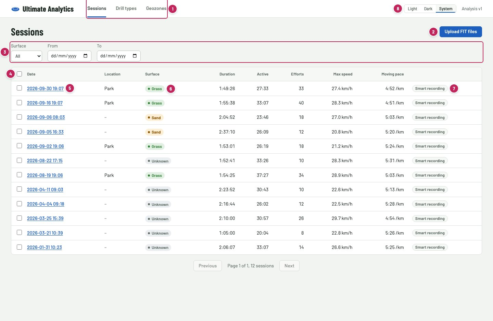
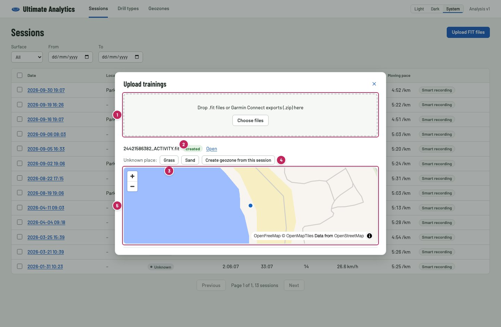
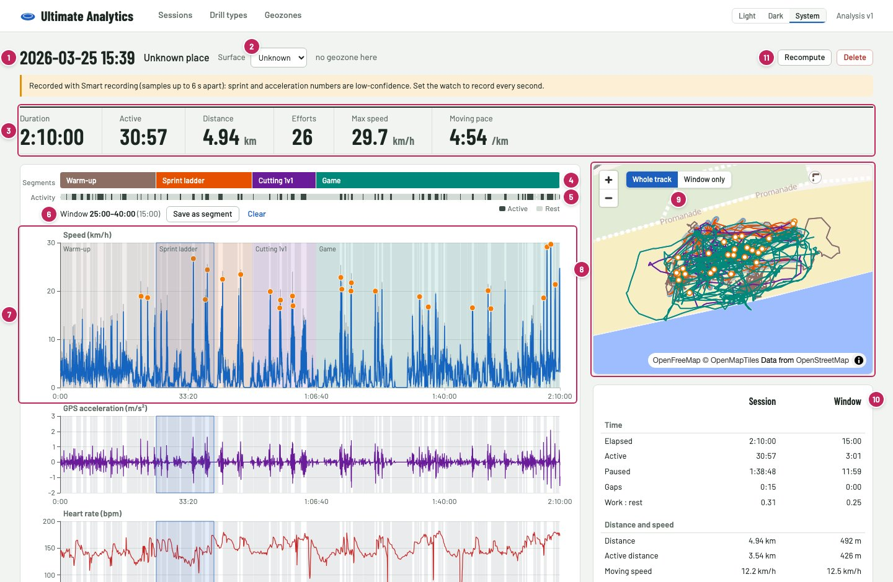
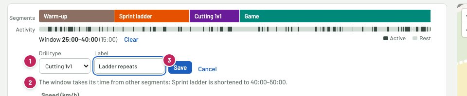
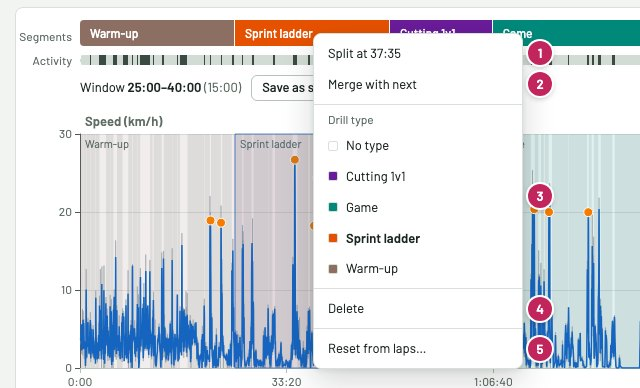
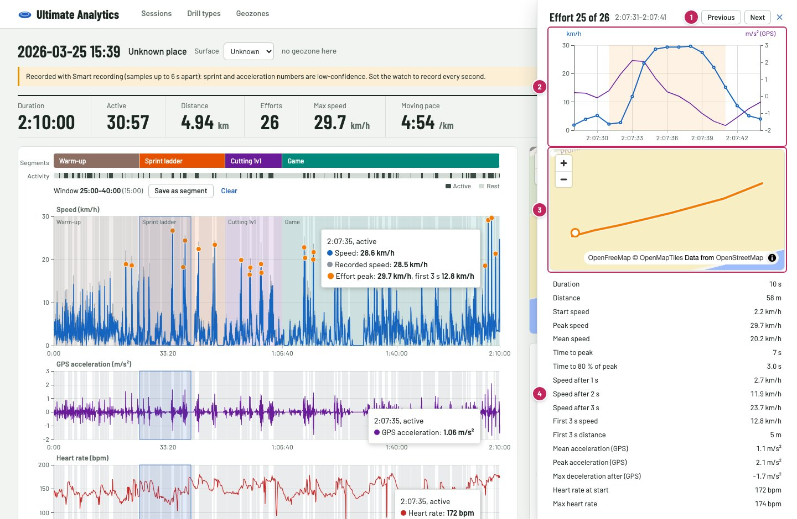
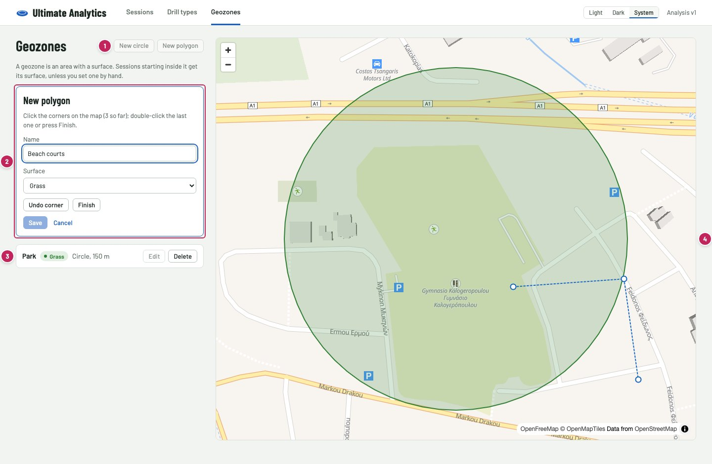
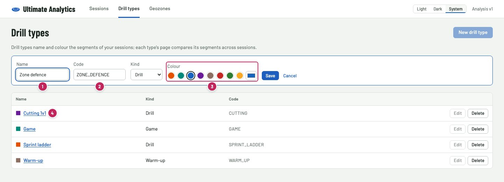
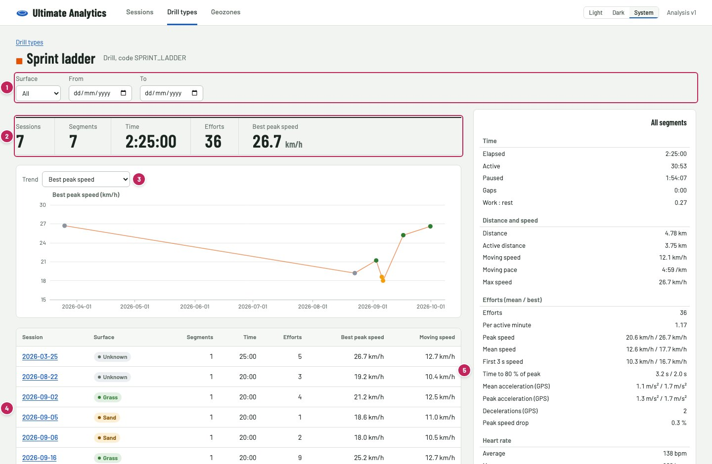
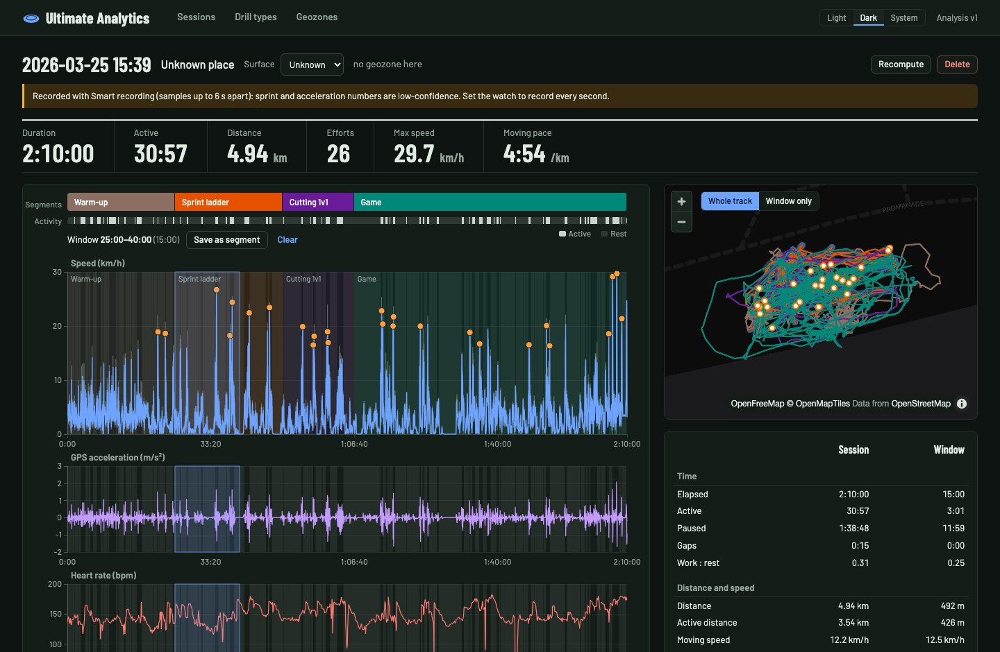

# User guide

Ultimate Analytics shows what happened in your Ultimate trainings: how often and how fast you sprinted, how much you
rested, and how drills compare across sessions, on grass and on sand. It reads the FIT files your Garmin watch
records.

The screenshots show real trainings. The numbers in them refer to the lists below each picture.

- [Before you start](#before-you-start)
- [Sessions](#sessions)
- [Uploading trainings](#uploading-trainings)
- [The session screen](#the-session-screen)
- [Selecting a window and saving it as a segment](#selecting-a-window-and-saving-it-as-a-segment)
- [Editing segments](#editing-segments)
- [One effort up close](#one-effort-up-close)
- [Geozones: where you train](#geozones-where-you-train)
- [Drill types and their statistics](#drill-types-and-their-statistics)
- [Light and dark](#light-and-dark)
- [Words used in the app](#words-used-in-the-app)

## Before you start

- **Record every second.** In the watch's settings, set *Data recording* to *Every Second*. With *Smart recording*
  the watch writes a sample only every few seconds, which is too coarse for sprints: those sessions carry a
  *Smart recording* badge and their sprint numbers are rough.
- **Press lap at every drill change.** Laps become the first segments of a session, so drills are labelled almost by
  themselves. A training recorded as one single lap starts without segments.
- **Get the files.** In Garmin Connect, open an activity and choose *Export original*: you get a `.zip` with the FIT
  file inside. The app takes the `.zip` as it is, or the `.fit` file.

## Sessions

1. **Sessions, Drill types, Geozones**: the three parts of the app.
2. **Upload FIT files** opens the upload dialog.
3. **Filters**: show only sessions on one surface, or between two dates. The filters stay in the page address, so a
   bookmark or a reload keeps them.
4. **Select**: tick sessions, or all of the page at once, to delete them. Deleting removes the session with its
   segments and notes; you can upload the file again later.
5. **A session**: click the date, or anywhere in the row, to open it. Times are local to where you trained.
6. **Surface**: grass, sand or unknown. Hover it to see where it comes from: a geozone, set by hand, or no geozone
   matches.
7. **Smart recording**: this session was not recorded every second; its sprint numbers are rough.
8. **Theme**: light, dark, or as your system is set.

## Uploading trainings

1. **Drop zone**: drop `.fit` files or Garmin Connect `.zip` exports here, or choose them. Several files at once are
   fine.
2. **Result** of each file: *created*, *already uploaded* (the same file was uploaded before), or *failed* with the
   reason. *Open* takes you to the session.
3. **Grass or Sand**: if the training took place somewhere no geozone covers, set its surface here.
4. **Create geozone from this session**: draws a circle around where the training started (150 m by default), with a
   name and a surface. Every session that started inside it, earlier or later, gets that surface.
5. **Map** of where the training started, with the geozones you already have. Other trainings at unknown places have
   *Show on map*.

## The session screen

1. **Date and place** of the training.
2. **Surface**: change it here if it is wrong. Next to it: where it comes from.
3. **Key numbers**: total duration, active time, distance, number of efforts, top speed and the pace while moving.
4. **Segments**: the parts of the training, coloured by drill type. Click one to select its time; see
   [Editing segments](#editing-segments).
5. **Activity**: dark where you were active, light where you rested, hatched where the watch lost the signal. Click a
   stretch to select it.
6. **Window**: the time you selected, with *Save as segment* and *Clear*.
7. **Charts**: speed (with the recorded speed as a faint line), GPS acceleration and heart rate, sharing one time
   axis. Grey bands are rest; coloured bands are segments; orange dots are the peaks of efforts. Hover to read the
   values of a second in all three charts; turn the mouse wheel to zoom and use the slider under the heart rate
   chart to move.
8. **Map** of the training: the track in the colours of its drills, the selected window as a blue glow, efforts as
   rings, and a dot that follows your mouse over the charts.
9. **Whole track / Window only**: show the whole training or only the selected window.
10. **Metrics**: everything the app measured, for the whole session and, when you select a window, for the window
    next to it. Hover a row to see how it is meant.
11. **Recompute** analyses the file again (your segments, notes and surface stay); **Delete** removes the session.

## Selecting a window and saving it as a segment

Drag across any chart to select a stretch of time; the charts, the map and the metrics show it at once. You can also
click a segment or an activity stretch. *Clear* or Escape removes the selection.

1. **Drill type and label** of the new segment; both are optional.
2. **What happens to other segments**: a new segment takes its time from segments it overlaps. They are shortened,
   split around it, or replaced, and the form tells you which before you save.
3. **Save** creates the segment.

## Editing segments

Drag the left or right edge of a segment to move it. Right-click a segment for more:

1. **Split** the segment where you clicked.
2. **Merge with next**: one segment from this and the following one.
3. **Drill type** of the segment, or none.
4. **Delete** the segment; its time becomes unlabelled.
5. **Reset from laps** throws away all segments of the session and starts again from the watch laps. It asks first.

## One effort up close

An *effort* is a sprint the app detected. Click an orange dot on the speed chart to open it:

1. **Previous / Next** effort, and close (or press Escape).
2. **Speed and GPS acceleration** from 3 s before the effort to 3 s after it; the effort is shaded.
3. **Path** of the effort on the map, from the start (ring) to the end.
4. **Effort numbers**: how fast you started, reached the top speed and how long it took, speed after 1, 2 and 3
   seconds, distance, acceleration and heart rate.

## Geozones: where you train

A geozone is an area with a surface. Every session that starts inside it gets its surface, unless you set one by
hand.

1. **New circle** (click the centre, then set the radius) or **New polygon** (click the corners, then double-click
   the last one or press *Finish*).
2. **Name and surface** of the geozone you are drawing; *Undo corner* takes back the last corner.
3. **Your geozones**: click one to find it on the map; *Edit* to rename it, change its surface or redraw it.
   *Delete* asks first.
4. **Map**: grass areas are green, sand areas amber.

After every change the app tells you how many sessions got a different surface.

## Drill types and their statistics

Drill types name and colour your segments, such as *Warm-up*, *Cutting 1v1* or *Game*.

1. **Name** of the drill type.
2. **Code**: filled in from the name; it has to be unique.
3. **Colour** of its segments, from the palette or any colour.
4. **A drill type**: click it to see its statistics.

1. **Filters**: one surface, or a date range, to compare grass with sand or this month with the last.
2. **Totals**: how many sessions and segments, how much time and how many efforts, and the best top speed.
3. **Trend**: pick the number to follow from session to session. Points are coloured by surface.
4. **Sessions** with this drill type; click a date to open the session.
5. **Metrics** of all its segments together.

## Light and dark

The switch in the top right sets the theme: light, dark, or as your system is set. Charts and maps follow it.

Satellite imagery is available when it is set up: see *Base maps* in the [README](../README.md#base-maps). The map
then shows a *Map / Satellite* switch.

## Words used in the app

| Word | Meaning |
| --- | --- |
| Session | One training: one FIT file. |
| Segment | A named part of a session, e.g. a drill or a game. Segments never overlap. |
| Drill type | The kind of a segment, e.g. *Warm-up*. Its statistics compare segments across sessions. |
| Window | A stretch of time you select on the charts. |
| Effort | A sprint the app detected, with its start, peak and end. |
| Active / rest | Rest (a *pause*) is at least 20 s slower than 5.4 km/h, standing or walking; a step faster for a second or two does not end it. All other time is active. |
| Moving pace | Pace over the active time faster than 7.2 km/h, so walking and rest do not slow it down. |
| GPS acceleration | Worked out from your speed, second by second. Good to compare sessions recorded the same way, but not a laboratory measurement. |
| Geozone | An area with a surface, used to tell grass sessions from sand sessions. |
| Smart recording | A watch setting that records only every few seconds; sprint numbers of such sessions are rough. |

## Updating the screenshots

The screenshots come from a script that fills a fresh, separate copy of the app with the training files in this
repository: `./infra/scripts/e2e.sh --config playwright.guide.config.ts`. It writes `docs/guide/*.jpg` and leaves
your own data alone.
